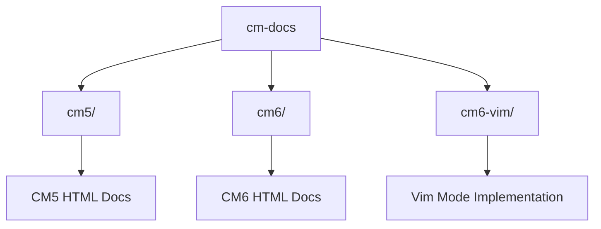

# CodeMirror Knowledge Base

Quick reference for navigating CodeMirror 5, CodeMirror 6, and CM6 Vim mode documentation.

> **For LLMs**: See [START-HERE.md](./START-HERE.md) for navigation guidance.

## Repository Structure

## Core Concepts

- **CM6** is the modern editor framework (state-based architecture)
- **CM6-Vim** (`@replit/codemirror-vim`) provides Vim bindings for CM6
- **CM5 Vim API** is the authoritative reference for Vim behavior
- CM6-Vim exposes a **compatibility layer** that mirrors CM5's Vim API

## Key Documentation Files

| Topic | CM5 | CM6 | CM6-Vim |
|-------|-----|-----|---------|
| Main Manual | [cm5/doc/manual.html](cm5/doc/manual.html) | [cm6/doc/manual.html](cm6/doc/manual.html) | [cm6-vim/README.md](cm6-vim/README.md) |
| Vim API | [cm5/doc/manual.html#vimapi](cm5/doc/manual.html#vimapi) | N/A | [cm6-vim/src/index.ts](cm6-vim/src/index.ts) |
| Architecture | [cm5/doc/internals.html](cm5/doc/internals.html) | [cm6/doc/internals.html](cm6/doc/internals.html) | [cm6-vim/src/cm_adapter.ts](cm6-vim/src/cm_adapter.ts) |
| Examples | [cm5/demo/](cm5/demo/) | [cm6/demo/](cm6/demo/) | [cm6-vim/dev/](cm6-vim/dev/) |

## Knowledge Base Contents

- [Architecture Overview](./architecture.md) - How CM5, CM6, and Vim mode relate
- [Vim Mode Guide](./vim-mode.md) - Comprehensive Vim API reference
- [API Quick Reference](./api-reference.md) - Most-used APIs and their locations
- [Examples Index](./examples.md) - Where to find working code samples
- [Common Patterns](./patterns.md) - Typical integration approaches
- [Visual Diagrams](./diagrams.md) - Mermaid flowcharts and sequence diagrams
- [FAQ](./faq.md) - Frequently asked questions
- [Troubleshooting](./troubleshooting.md) - Common issues and solutions

## Quick Lookups

### For CM6 + Vim Integration Questions
1. Check [vim-mode.md](./vim-mode.md) for the API
2. Review [architecture.md](./architecture.md) for how layers connect
3. Look at [cm6-vim/README.md](../cm6-vim/README.md) for setup examples

### For Vim Behavior Questions
1. Reference [cm5/doc/manual.html#vimapi](../cm5/doc/manual.html) (lines 3532-3762)
2. Check [vim-mode.md](./vim-mode.md) for method signatures

### For CM6 Core Questions
1. See CM6 manual at [cm6/doc/manual.html](../cm6/doc/manual.html)
2. Review [api-reference.md](./api-reference.md) for common methods
