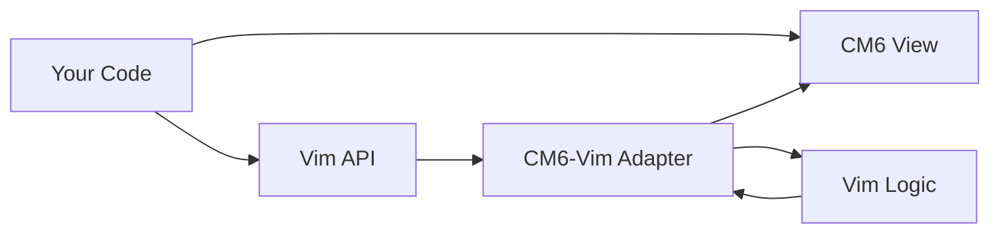

# API Quick Reference

Fast lookup for common CM5, CM6, and Vim APIs.

## CM6 Core APIs

### Basic Setup

**File**: CM6 online docs at codemirror.net/6

```typescript
import { EditorView, basicSetup } from 'codemirror'
import { javascript } from '@codemirror/lang-javascript'

const view = new EditorView({
  doc: "console.log('hello')",
  extensions: [basicSetup, javascript()],
  parent: document.body
})
```

### State & Transactions

| API | Purpose | Example |
|-----|---------|---------|
| `view.state` | Current editor state | `const text = view.state.doc.toString()` |
| `view.dispatch(tr)` | Apply transaction | `view.dispatch({ changes: { from: 0, insert: "text" }})` |
| `EditorSelection` | Manage selections | `EditorSelection.single(0, 10)` |

**Ref**: [cm6/doc/manual.html](../cm6/doc/manual.html)

### Extensions

```typescript
import { Extension } from '@codemirror/state'
import { keymap } from '@codemirror/view'

const myExtension: Extension = keymap.of([
  { key: "Ctrl-s", run: (view) => { save(); return true }}
])
```

## CM5 APIs (Reference Only)

**Location**: [cm5/doc/manual.html#api](../cm5/doc/manual.html)

### Constructor & Content

| Method | Purpose | 
|--------|---------|
| `cm.getValue()` | Get full document text |
| `cm.setValue(text)` | Replace document |
| `cm.getRange(from, to)` | Get text in range |
| `cm.replaceRange(text, from, to)` | Replace range |
| `cm.getLine(n)` | Get line n |

### Selection

| Method | Purpose |
|--------|---------|
| `cm.getCursor()` | Get cursor position |
| `cm.setCursor(pos)` | Set cursor |
| `cm.getSelection()` | Get selected text |
| `cm.replaceSelection(text)` | Replace selection |

### Events

```javascript
cm.on("change", (cm, changeObj) => { })
cm.on("cursorActivity", (cm) => { })
cm.on("beforeChange", (cm, changeObj) => { })
```

## Vim API Summary

**Full reference**: [vim-mode.md](./vim-mode.md)

### Most Common Methods

```typescript
import { vim, getCM, Vim } from '@replit/codemirror-vim'

// Setup
const view = new EditorView({ extensions: [vim()] })
const cm = getCM(view)

// Key mapping
Vim.map("jj", "<Esc>", "insert")
Vim.noremap("Y", "y$", "normal")
Vim.unmap("jj", "insert")

// Ex commands
Vim.defineEx("write", "w", (cm, params) => { save() })

// Custom operators/motions
Vim.defineOperator("uppercase", (cm, args, ranges) => { })
Vim.defineMotion("nextSection", (cm, head, args) => { })

// Mode control
Vim.exitInsertMode(cm)
Vim.handleKey(cm, "<Esc>", "user")

// Events
cm.on("vim-mode-change", (modeObj) => { })
```

### Options

```typescript
Vim.setOption("hlsearch", true)
Vim.getOption("ignorecase")
```

## File Locations Cheatsheet

### Primary Docs

| Topic | File | Lines |
|-------|------|-------|
| CM5 Manual | [cm5/doc/manual.html](../cm5/doc/manual.html) | All |
| CM5 Vim API | [cm5/doc/manual.html](../cm5/doc/manual.html) | 3532-3762 |
| CM6 Manual | [cm6/doc/manual.html](../cm6/doc/manual.html) | All |
| CM6-Vim README | [cm6-vim/README.md](../cm6-vim/README.md) | All |

### Implementation

| Component | File |
|-----------|------|
| Vim plugin entry | [cm6-vim/src/index.ts](../cm6-vim/src/index.ts) |
| CM5 compatibility | [cm6-vim/src/cm_adapter.ts](../cm6-vim/src/cm_adapter.ts) |
| Vim logic | [cm6-vim/src/vim.js](../cm6-vim/src/vim.js) |
| Block cursor | [cm6-vim/src/block-cursor.ts](../cm6-vim/src/block-cursor.ts) |

### Examples

| Demo | Location |
|------|----------|
| CM5 Vim demo | [cm5/demo/vim.html](../cm5/demo/vim.html) |
| CM6 demos | [cm6/demo/](../cm6/demo/) |
| CM6-Vim dev | [cm6-vim/dev/](../cm6-vim/dev/) |

## Common Task → API Mapping

| Task | API | Source |
|------|-----|--------|
| Add Vim to CM6 | `vim()` extension | [vim-mode.md](./vim-mode.md) |
| Map keys in Vim | `Vim.map()` | [vim-mode.md](./vim-mode.md#vimmaplhs-rhs-context) |
| Custom ex cmd | `Vim.defineEx()` | [vim-mode.md](./vim-mode.md#vimdefineexname-prefix-fn) |
| Custom operator | `Vim.defineOperator()` | [vim-mode.md](./vim-mode.md#vimdefineoperatorname-fn) |
| Exit insert mode | `Vim.exitInsertMode()` | [vim-mode.md](./vim-mode.md#vimexitinsertmodecm) |
| Track mode changes | `cm.on("vim-mode-change")` | [vim-mode.md](./vim-mode.md#vim-mode-change) |
| Get CM5 API from CM6 | `getCM(view)` | [vim-mode.md](./vim-mode.md#setup-cm6) |

## Architectural Quick Facts



- **CM6**: Modern state-based editor
- **CM6-Vim**: Adds Vim mode to CM6
- **CM5 API**: Exposed by CM6-Vim for compatibility
- **Vim Logic**: Core implementation (ported from CM5)

**Key insight**: Use CM6 APIs for editor features, Vim API for Vim customization.
