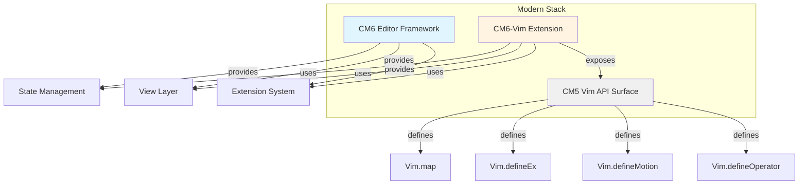
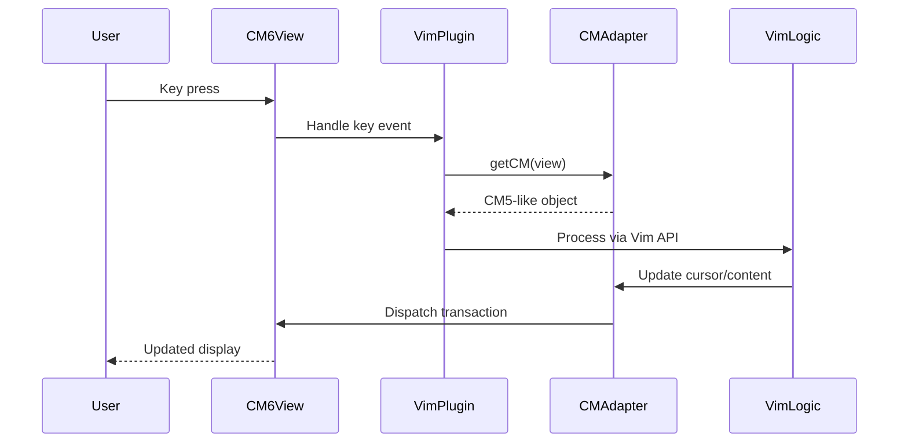

# CodeMirror Architecture Overview

## Three-Layer Model



## Component Responsibilities

### CM6 Core (`cm6/`)
- **What**: Modern editor framework
- **Provides**: State, transactions, extensions, view rendering
- **Key concepts**: 
  - Immutable state
  - Functional updates via transactions
  - Extension-based architecture
  - Facets and state fields

**Key files**:
- `cm6/doc/manual.html` - Full API documentation
- `cm6/doc/internals.html` - Architecture deep-dive

### CM6-Vim (`cm6-vim/`)
- **What**: Vim mode implementation for CM6
- **Provides**: Vim keybindings, motions, operators, ex commands
- **Exposes**: CM5-compatible Vim API via `getCM(view)` and `Vim` object

**Key files**:
- `cm6-vim/src/index.ts` - Main plugin and view integration
- `cm6-vim/src/cm_adapter.ts` - CM5 API compatibility layer
- `cm6-vim/src/vim.js` - Core Vim logic (port from CM5)
- `cm6-vim/README.md` - Usage guide

### CM5 Vim Reference (`cm5/`)
- **What**: Legacy editor (for reference only)
- **Provides**: Authoritative documentation for Vim API behavior
- **Status**: Not used directly; API surface is replicated in CM6-Vim

**Key files**:
- `cm5/doc/manual.html#vimapi` (lines 3532-3762) - Vim API docs

## Data Flow



## Integration Points

### Using Vim Mode in CM6

```typescript
import { EditorView } from 'codemirror'
import { vim, getCM, Vim } from '@replit/codemirror-vim'

// 1. Add vim extension to CM6
const view = new EditorView({
  extensions: [vim(), /* other extensions */]
})

// 2. Access CM5-like API
const cm = getCM(view)

// 3. Use Vim API (CM5 compatible)
Vim.map("jj", "<Esc>", "insert")
Vim.defineEx("write", "w", () => { /* save */ })
```

### Why This Architecture?

1. **CM6** provides the robust editor foundation
2. **CM6-Vim** bridges CM6 and classic Vim behaviors
3. **CM5 API surface** ensures compatibility with existing Vim customizations

## Critical Distinctions

| Aspect | CM5 | CM6 |
|--------|-----|-----|
| State model | Mutable | Immutable |
| Updates | In-place | Transaction-based |
| Extensions | Side effects | Functional composition |
| Vim API | Native | Via adapter layer |

**Rule**: When working with Vim, use the CM5 API through `getCM(view)`. For editor features, use CM6 APIs directly on the `EditorView`.
