# Vim API Flow Diagrams

Visual reference for understanding how Vim mode processes commands and interacts with CM6.

## Command Processing Flow

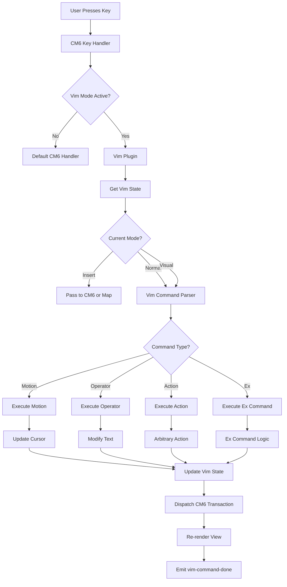

## Mode Transitions

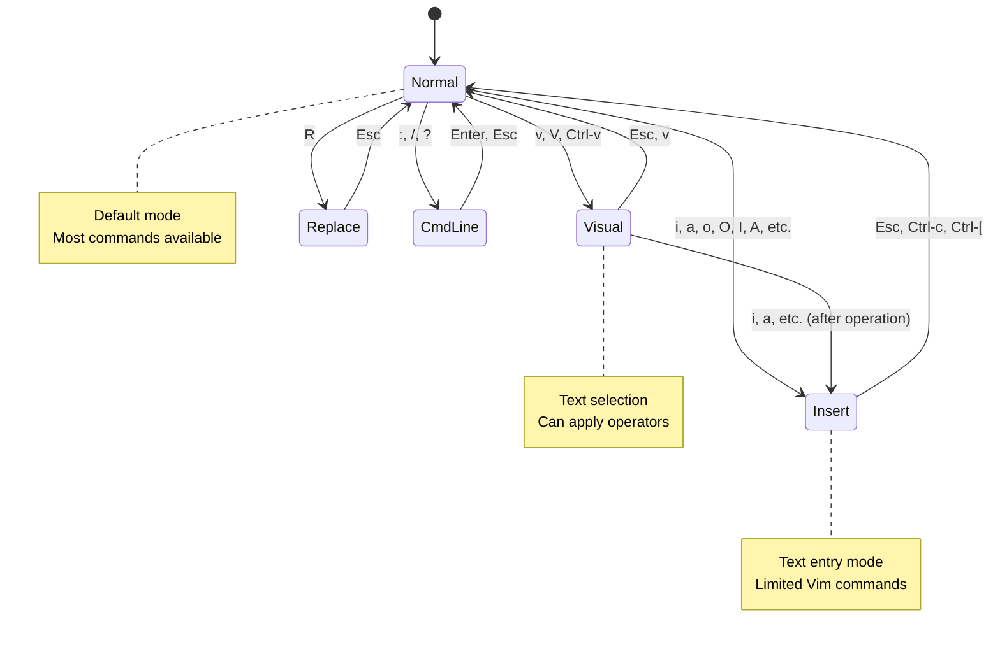

## Operator + Motion Composition

**Examples**:
- `d` (operator) + `w` (motion) → delete word
- `c` (operator) + `2j` (motion) → change 2 lines down
- `y` (operator) + `$` (motion) → yank to end of line

## Ex Command Lifecycle

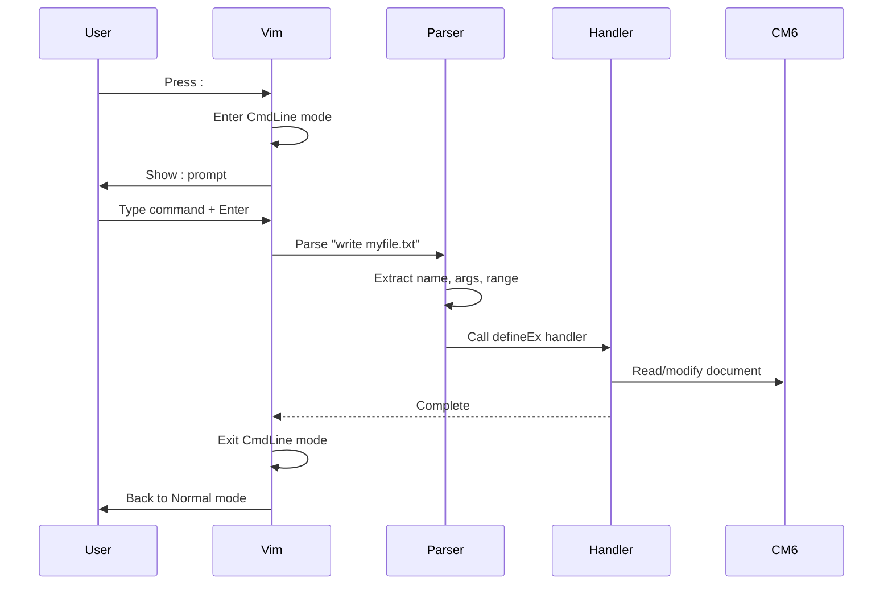

## Custom Command Integration

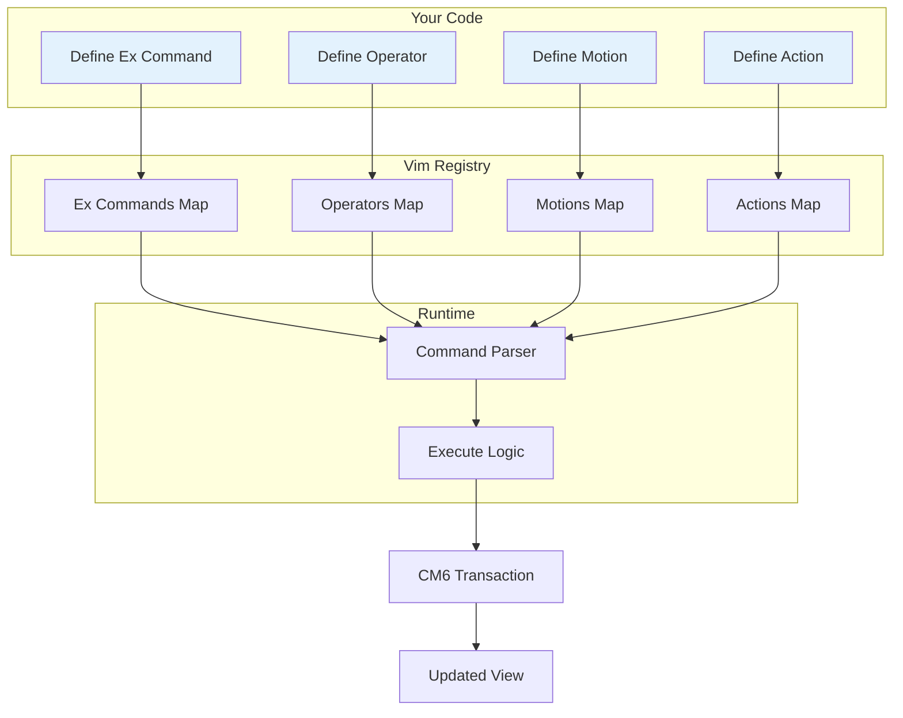

## Key Mapping Resolution

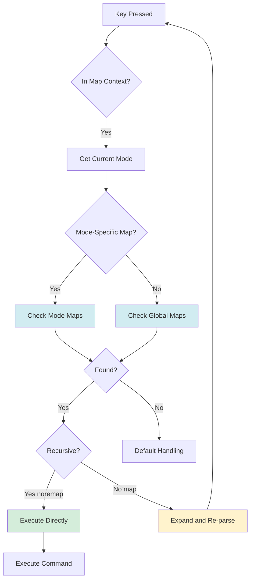

**Example**:
1. User presses `Y`
2. Check normal mode maps
3. Find `Y` → `y$` mapping
4. If `noremap`: execute `y$` directly
5. If `map`: expand to `y$` and re-parse (could map further)

## CM5 Adapter Bridge

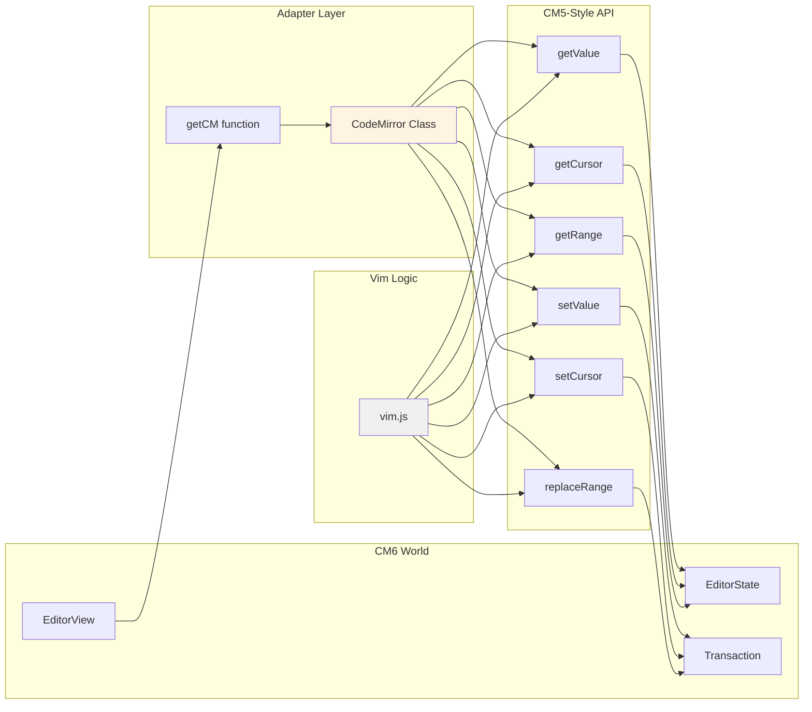

## Event Flow

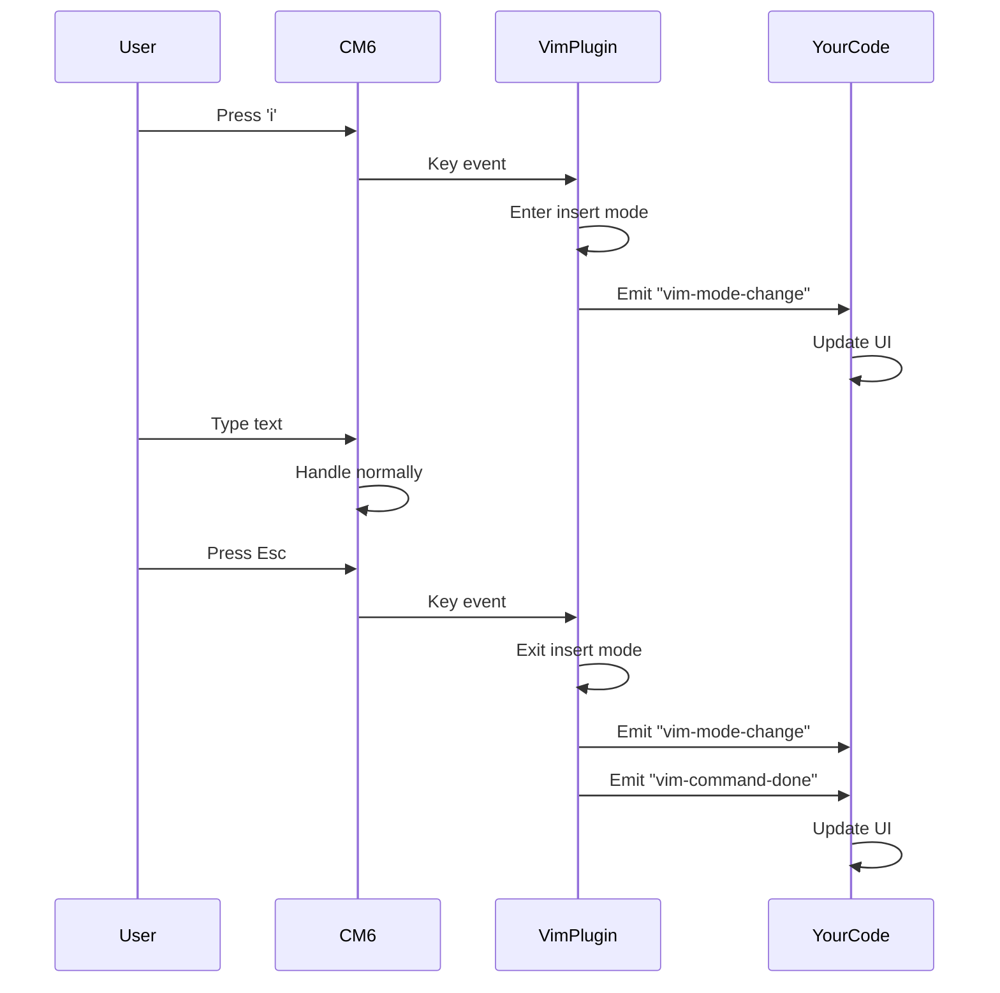

## Register System

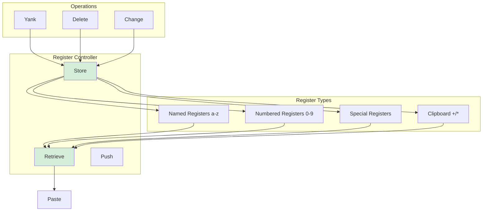

## Visual Mode Range Selection

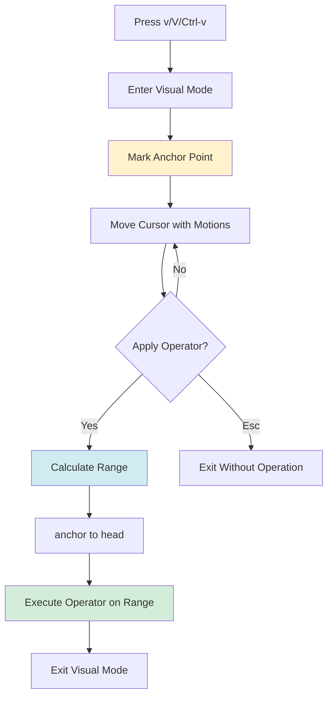

## Plugin Initialization

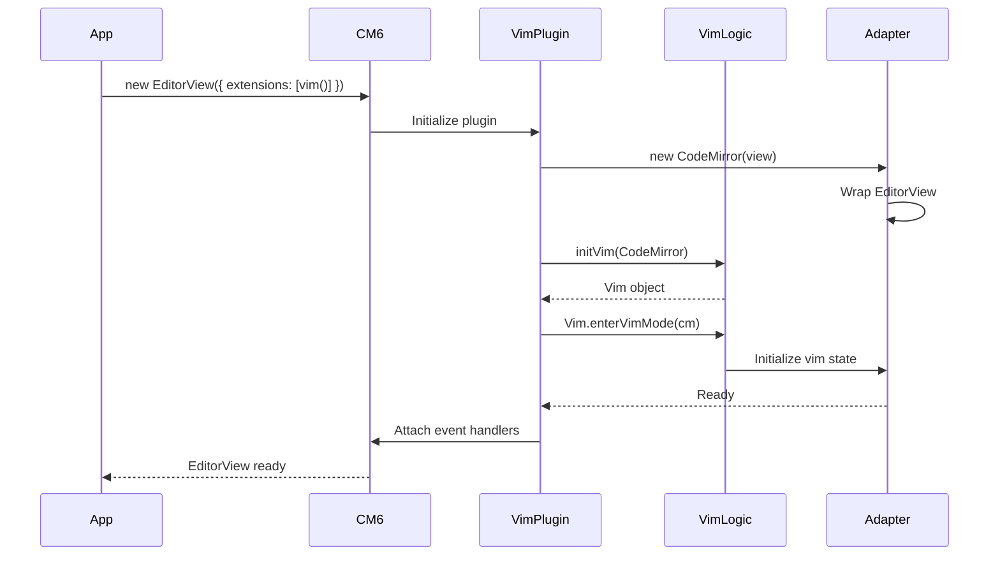

## Decision Tree: Which API to Use

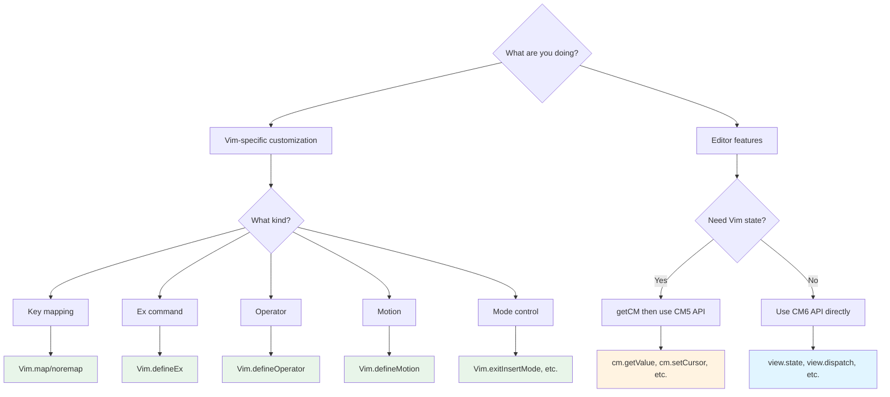
