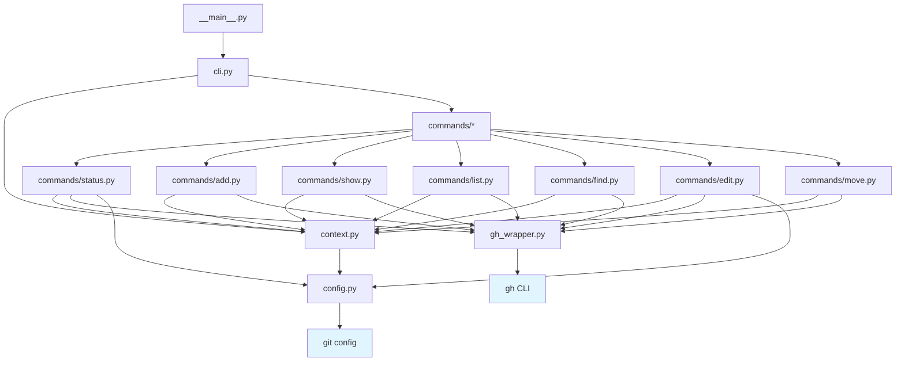
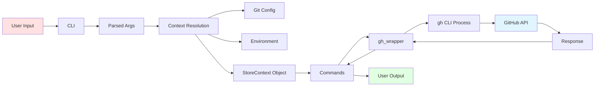
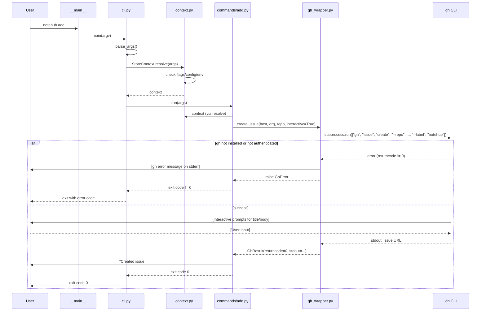
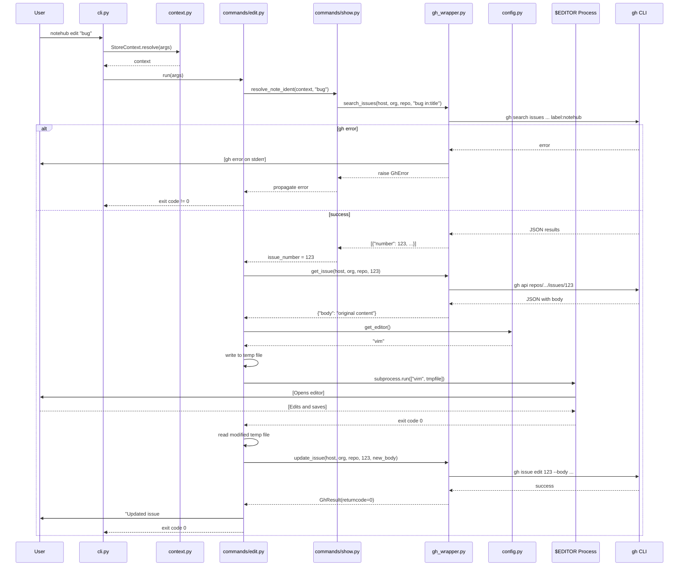
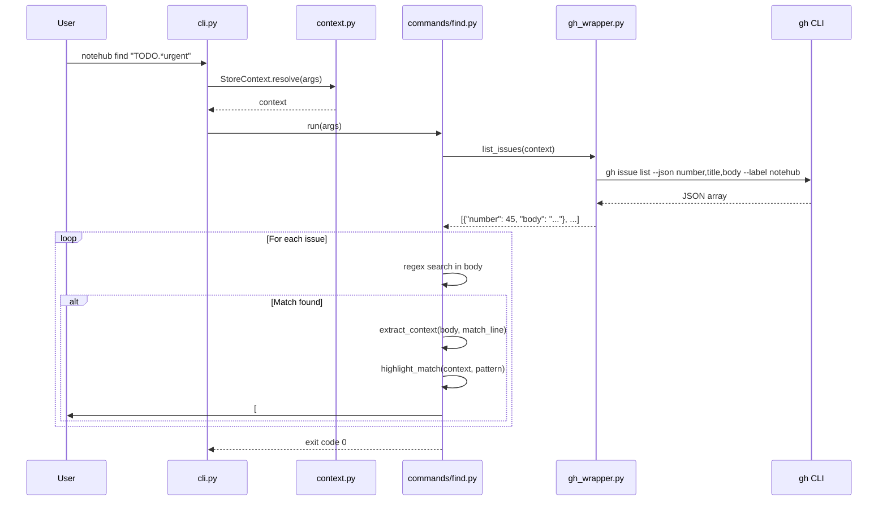

# Notehub: Design Overview

## 1. Module Responsibilities & Public APIs

### 1.1 `__main__.py` - Application Entry Point
**Responsibility**: Bootstrap the application and hand off to CLI parser.

```python
# Public API
def main() -> int:
    """Entry point. Returns exit code."""
    pass
```

### 1.2 `cli.py` - Command-Line Interface Parser
**Responsibility**: Parse command-line arguments and dispatch to appropriate command handlers.

```python
# Public API
def main(argv: list[str]) -> int:
    """Parse args and dispatch to commands. Returns exit code."""
    pass

def create_parser() -> argparse.ArgumentParser:
    """Build the argument parser with all subcommands."""
    pass
```

### 1.3 `context.py` - Store Context Resolution
**Responsibility**: Determine host/org/repo based on flags, git config, environment, and defaults.

```python
# Public API
class StoreContext:
    host: str
    org: str
    repo: str
    
    @classmethod
    def resolve(cls, args: Namespace) -> StoreContext:
        """Resolve context from args, config, env, defaults."""
        pass
    
    def repo_identifier(self) -> str:
        """Return 'org/repo' string."""
        pass
    
    def full_identifier(self) -> str:
        """Return 'host:org/repo' string."""
        pass
```

### 1.4 `config.py` - Configuration Management
**Responsibility**: Read/write git config values for notehub settings.

```python
# Public API
def get_git_config(key: str, global_only: bool = False) -> str | None:
    """Retrieve git config value for notehub.{key}."""
    pass

def set_git_config(key: str, value: str, global_scope: bool = False) -> None:
    """Set git config notehub.{key} = value."""
    pass

def get_editor() -> str:
    """Return editor path from $EDITOR or default to 'vi'."""
    pass
```

### 1.5 `gh_wrapper.py` - GitHub CLI Wrapper
**Responsibility**: Execute `gh` commands and manage stdin/stdout/stderr.

**Label Convention**: All notehub-created issues are tagged with the `notehub` label. This label is:
- Automatically added during issue creation
- Used as a filter when listing/searching issues
- Ensures notehub only operates on its own issues, not interfering with other GitHub issues

```python
# Public API
class GhError(Exception):
    """gh CLI invocation failed."""
    def __init__(self, returncode: int, stderr: str):
        self.returncode = returncode
        self.stderr = stderr

class GhResult:
    returncode: int
    stdout: str
    stderr: str

def create_issue(host: str, org: str, repo: str, interactive: bool = True) -> GhResult:
    """Invoke gh issue create with 'notehub' label."""
    pass

def get_issue(host: str, org: str, repo: str, issue_number: int) -> dict:
    """Fetch issue JSON via gh api."""
    pass

def update_issue(host: str, org: str, repo: str, issue_number: int, body: str) -> GhResult:
    """Update issue body via gh issue edit."""
    pass

def list_issues(host: str, org: str, repo: str, filters: dict = None) -> list[dict]:
    """List issues with 'notehub' label via gh issue list --json."""
    pass

def search_issues(host: str, org: str, repo: str, query: str) -> list[dict]:
    """Search issues with 'notehub' label via gh search issues."""
    pass
```

### 1.6 `commands/status.py` - Status Command
**Responsibility**: Display context, auth state, and user identity.

```python
# Public API
def run(args: Namespace) -> int:
    """Execute status command. Returns exit code."""
    pass
```

### 1.7 `commands/add.py` - Add Command
**Responsibility**: Create new note-issues.

```python
# Public API
def run(args: Namespace) -> int:
    """Execute add command. Returns exit code."""
    pass
```

### 1.8 `commands/show.py` - Show Command
**Responsibility**: Display note-header and URLs for specified note-idents.

```python
# Public API
def run(args: Namespace) -> int:
    """Execute show command. Returns exit code."""
    pass

def resolve_note_ident(context: StoreContext, ident: str) -> int | None:
    """Resolve note-ident to issue number."""
    pass

def format_note_header(issue: dict) -> str:
    """Format issue as [#123] Title."""
    pass
```

### 1.9 `commands/list.py` - List Command
**Responsibility**: List all note-issues (filtered by 'notehub' label).

```python
# Public API
def run(args: Namespace) -> int:
    """Execute list command. Returns exit code."""
    pass
```

### 1.10 `commands/find.py` - Find Command
**Responsibility**: Search note-issue bodies with regex and display matches in context (filtered by 'notehub' label).

```python
# Public API
def run(args: Namespace) -> int:
    """Execute find command. Returns exit code."""
    pass

def highlight_match(text: str, pattern: str) -> str:
    """Return text with ANSI color codes highlighting pattern."""
    pass

def extract_context(body: str, match_line: int, context_lines: int = 1) -> str:
    """Extract lines around match with context."""
    pass
```

### 1.11 `commands/edit.py` - Edit Command
**Responsibility**: Open note-issue in $EDITOR and sync changes.

```python
# Public API
def run(args: Namespace) -> int:
    """Execute edit command. Returns exit code."""
    pass

def open_in_editor(content: str, editor: str) -> str | None:
    """Open temp file in editor, return modified content or None if unchanged."""
    pass
```

### 1.12 `commands/move.py` - Move Command
**Responsibility**: Transfer note-issues across repos/orgs.

```python
# Public API
def run(args: Namespace) -> int:
    """Execute move command. Returns exit code."""
    pass

def extract_issue_data(host: str, org: str, repo: str, issue_number: int) -> dict:
    """Extract full issue data for recreation."""
    pass

def recreate_issue(host: str, org: str, repo: str, data: dict) -> int:
    """Recreate issue in target repo. Returns new issue number."""
    pass
```

---

## 2. Structural Diagrams

### 2.1 Component Architecture



### 2.2 Data Flow & Dependencies



---

## 3. Sequence Diagrams

### 3.1 `notehub add` Command Flow



### 3.2 `notehub edit <note-ident>` Command Flow



### 3.3 `notehub find <regex>` Command Flow



---

## 4. `gh` CLI Integration Design

### 4.1 Design Principles

1. **Delegation**: All GitHub API interactions delegated to `gh` CLI
2. **No Direct API Calls**: Never call GitHub REST/GraphQL APIs directly
3. **Subprocess Management**: Use Python `subprocess` for `gh` invocations
4. **I/O Modes**: Support both interactive (passthrough) and programmatic (JSON) modes
5. **Error Transparency**: Pass through `gh` stderr to user; check return codes
6. **Authentication**: Rely entirely on `gh auth` status
7. **Fail-Fast Execution**: Commands trust their dependencies and let errors surface naturally

### 4.2 Error Handling Philosophy

**Commands do NOT check prerequisites**:
- No `check_gh_installed()` calls
- No `check_gh_auth()` calls
- No validation of context before execution

**Rationale**:
1. **Single Responsibility**: Commands focus on their core task
2. **User Agency**: User can run `notehub status` to validate setup
3. **Natural Errors**: `gh` errors are clear and actionable
4. **Performance**: Skip redundant checks on every invocation
5. **UNIX Philosophy**: Programs fail with meaningful error messages when dependencies missing

**Error Flow**:
```
Command → gh_wrapper → gh CLI → {success | error}
                                      ↓
                                User sees gh's error message
```

**Examples of natural errors**:
- `gh` not installed → `sh: gh: command not found`
- Not authenticated → `gh: To use GitHub CLI, run 'gh auth login'`
- Invalid repo → `gh: repository not found`
- Network error → `gh: failed to connect to github.com`

**The `status` command is the exception**:
- Explicitly checks `gh` installation
- Explicitly checks authentication
- Displays helpful setup instructions
- Purpose: help user diagnose environment issues

### 4.3 Interaction Modes

#### Interactive Mode (for `add`, `edit`)
```python
# Pass stdin/stdout/stderr directly to user terminal
result = subprocess.run(
    ["gh", "issue", "create", "--repo", f"{host}:{org}/{repo}"],
    stdin=sys.stdin,
    stdout=sys.stdout,
    stderr=sys.stderr
)
```

**Characteristics**:
- User sees `gh` prompts directly
- User provides input interactively
- ANSI colors and formatting preserved
- No parsing of output needed

#### Programmatic Mode (for `list`, `show`, `find`)
```python
# Capture JSON output for parsing
result = subprocess.run(
    ["gh", "issue", "list", "--repo", f"{host}:{org}/{repo}", "--json", "number,title,body"],
    capture_output=True,
    text=True
)
data = json.loads(result.stdout)
```

**Characteristics**:
- Request JSON output via `--json` flag
- Capture stdout for parsing
- Stderr still goes to user (warnings, errors)
- Structured data for processing

#### Hybrid Mode (for `edit`)
```python
# 1. Fetch data programmatically
issue_json = gh_api_get(f"repos/{org}/{repo}/issues/{num}")

# 2. User edits in $EDITOR (local process)
modified = edit_in_editor(issue_json["body"])

# 3. Update programmatically
gh_issue_edit(num, body=modified)
```

### 4.4 Error Handling Strategy

```python
class GhError(Exception):
    """gh CLI invocation failed."""
    def __init__(self, returncode: int, stderr: str):
        self.returncode = returncode
        self.stderr = stderr

def run_gh(cmd: list[str], capture: bool = True) -> GhResult:
    """Run gh command with error handling."""
    if capture:
        result = subprocess.run(cmd, capture_output=True, text=True)
    else:
        result = subprocess.run(cmd)
    
    if result.returncode != 0:
        if capture:
            # stderr was captured, show it to user
            print(result.stderr, file=sys.stderr)
        raise GhError(result.returncode, result.stderr if capture else "")
    
    return GhResult(
        returncode=result.returncode,
        stdout=result.stdout if capture else "",
        stderr=result.stderr if capture else ""
    )

# Commands use this pattern - no pre-checks needed:
def run(args: Namespace) -> int:
    """Execute command - let gh errors surface naturally."""
    context = StoreContext.resolve(args)
    
    try:
        result = create_issue(context.host, context.org, context.repo)
        print(f"Created issue: {extract_url(result.stdout)}")
        return 0
    except GhError as e:
        # gh's error message already printed to stderr
        return e.returncode
```

### 4.5 Authentication Check (Status Command Only)

```python
def check_gh_auth(host: str = "github.com") -> bool:
    """Verify gh is authenticated for host. Used ONLY by status command."""
    result = subprocess.run(
        ["gh", "auth", "status", "--hostname", host],
        capture_output=True
    )
    return result.returncode == 0

def check_gh_installed() -> bool:
    """Check if gh CLI is available. Used ONLY by status command."""
    result = subprocess.run(
        ["which", "gh"],
        capture_output=True
    )
    return result.returncode == 0

# Only status command uses these checks:
def run(args):
    context = StoreContext.resolve(args)
    
    if not check_gh_installed():
        print("✗ gh CLI not found")
        print("  Install from https://cli.github.com/")
        return 0  # Status is informational, always returns 0
    
    if check_gh_auth(context.host):
        print(f"✓ Authenticated to {context.host}")
    else:
        print(f"✗ Not authenticated. Run: gh auth login --hostname {context.host}")
    
    return 0
```

---

## 5. Design Decisions & Rationale

### 5.1 Why Delegate to `gh`?
- **Authentication**: `gh` handles OAuth, tokens, multiple hosts
- **API Stability**: GitHub maintains `gh` compatibility
- **Enterprise Support**: GHES support built into `gh`
- **Maintenance**: No need to track API changes
- **Error Messages**: `gh` provides clear, actionable error messages

### 5.2 Why the 'notehub' Label?

**Purpose**: Distinguish notehub-managed issues from regular GitHub issues.

**Benefits**:
1. **Separation of Concerns**: Notehub operations don't interfere with regular issue tracking
2. **Filtering**: Easy to identify which issues are notes vs. actual project issues
3. **Safety**: Commands like `list` and `find` only show notehub notes
4. **Flexibility**: Users can still see all issues in GitHub UI, with notehub notes clearly labeled

**Implementation**:
- All `create_issue()` calls include `--label notehub`
- All `list_issues()` calls include `--label notehub` filter
- All `search_issues()` calls include `label:notehub` in query
- Label is created automatically by GitHub if it doesn't exist

**User Experience**:
- In GitHub UI: Issues show "notehub" label badge
- In notehub CLI: Label is invisible to user (implementation detail)
- Users can manually add/remove label if needed (though not recommended)

### 5.3 Why No Prerequisite Checks in Commands?
- **Separation of Concerns**: `status` command is the diagnostic tool
- **Reduced Complexity**: Commands focus on their single responsibility
- **Better Performance**: No redundant validation on every invocation
- **Natural Error Flow**: `gh` errors are self-explanatory
- **User Experience**: If `gh` not installed, any command will fail immediately with clear message
- **Developer Experience**: Simpler command implementations, easier to maintain

### 5.4 When Should Commands Validate?
**Never check**:
- ✗ `gh` installation
- ✗ Authentication status
- ✗ Network connectivity
- ✗ Repository existence

**Do check** (minimal validation):
- ✓ Required arguments present (argparse handles this)
- ✓ Issue number is valid integer when needed
- ✓ File paths exist when required (e.g., for `edit`)

**The `status` command is special**:
- Purpose: diagnose environment and configuration
- Checks `gh` installation, authentication, user identity
- Provides setup instructions
- Always returns 0 (informational, not transactional)

